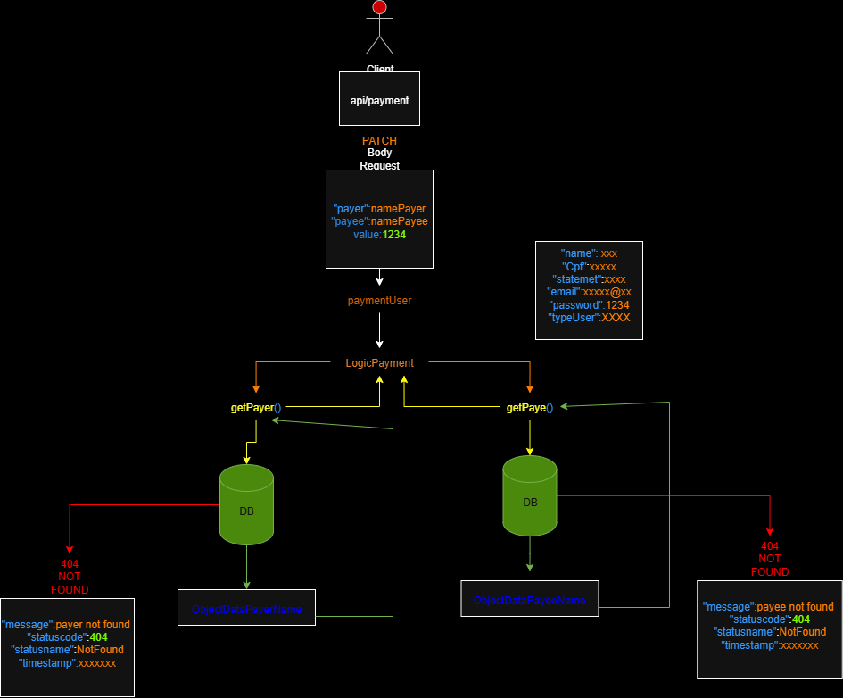

<h1 style="text-align: center;">
    <strong>Aplicação do Pic-Pay Simplificado</strong>
    
</h1>

<h1><strong>Objetivo Do Pic-Pay Simplificado 🎯</strong></h1>

<p><strong>    O desafio do PicPay consiste em criar uma aplicação CRUD para gerenciar usuários e suas transações.</strong> Cada usuário possui id, name, email, cpf, password (4 dígitos), statement e typeUser, sendo que typeUser é um enum com dois valores: USER, que pode enviar e receber transferências, e STOREKEEPER, que só pode receber. A aplicação deve permitir as quatro operações básicas: Create (cadastrar usuário), Read (consultar usuário por id ou lista paginada/ordenada), Update (atualizar informações) e Delete (remover usuário). O sistema precisa garantir que CPF e email sejam únicos e respeitar as regras de cada tipo de usuário, permitindo que a API gerencie corretamente os dados e as transações.</p>

<h1 style="text-align:center;">Tecnologias Usadas No Desafio</h1>

<strong>Spring Boot-</strong>  

<strong>Maven-</strong> 


<strong>Swagger-</strong> 


<h1>Formato Do Json No corpo Quando Enviar A Transferencia</h1>

```json
{
  "payer": "assumed name", //nome de quem faz a transferencia
  "payee": "assumed name", //nome de quem receberá a traaferencia
  "value":100.00 //valor da transferencia
}
```


<h1>Formato Do Json No Corpo Para Efetuar O Crud</h1>

```json
{
  "name": " name User",
  "email": "email user",
  "typeUser":"USER", //Ou STOREKEEPER
  "statement":200.00, //valor do extrato do usuario
  "cpf":"12345678900",
  "id":12  // se nao for um metodo POST, se for Post recebera uma exception  
}
```


<h1 style="text-align:center;">Arquitetura Do Software</h1>
<pre>src
└─ main
   └─ java
      ├─ controller
      │  ├─ ControllerPaymentPerson
      │  └─ PersonControllerCrud
      │
      ├─ cfg
      │  └─ ContentNegotiation
      │
      ├─ docs
      │  ├─ DocControllerPaymentPerson
      │  ├─ Doc
      │  └─ PersonControllerCrud
      │
      ├─ dto
      │  ├─ payment
      │  │  └─ DtoPaymentPerson
      │  ├─ post
      │  │  └─ DtoPost
      │  ├─ put
      │  │  └─ DtoPut
      │  └─ returns
      │     ├─ DtoPersonComplete
      │     └─ DtoReturnPartial
      │
      ├─ enums
      │  └─ StatusTypeClient
      │
      ├─ exceptions
      │  ├─ handler
      │  │  ├─ BadRequestResponse
      │  │  ├─ NotFoundResponse
      │  │  └─ UnrecognizedProperty
      │  ├─ responsegeneric
      │  │  └─ ResponseGeneric
      │  └─ types
      │     ├─ BadRequest
      │     └─ NotFound
      │
      ├─ mapper
      │  └─ MapperDozzer
      │
      ├─ model
      │  └─ Person
      │
      ├─ repository
      │  └─ PersonRepository
      │
      ├─ service
      │  ├─ PaymentService
      │  └─ PeopleRegisterService
      │
      └─ validation
         ├─ controller
         │  ├─ helper
         │  │  └─ CheckData
         │  ├─ interfaces
         │  │  └─ CheckPageable
         │  └─ implementations
         │     └─ ImplementCheckPageablePerson
         │
         ├─ repository
         │  └─ ValidationRepositoryPerson
         │
         └─ service
            ├─ helper
            │  ├─ FormattingCpf
            │  └─ ValidationTypeData
            ├─ interfaces
            │  ├─ ValidationPatch
            │  └─ ValidationPassword
            ├─ implementations
            │  ├─ ImplementationValidationPatchPerson
            │  └─ ImplementationValidationPasswordPerson
            └─ payment
               └─ LogicPayment
 </pre>

<h2>Ideia Sobre O Uso Desta Arquitetura 🧠</h2>

<p><strong>A arquitetura que defini segue o padrão MVC (Model–View–Controller), que considero uma das abordagens mais eficazes para organizar aplicações Java com Spring Boot.</strong> Na minha estrutura, <strong>a camada Controller é responsável por receber as requisições, interpretar os dados de entrada, chamar os serviços necessários e retornar as respostas apropriadas.</strong><strong> A camada Service concentra toda a lógica de negócio, mantendo meus controladores leves e organizados.</strong><strong> A camada Repository cuida do acesso ao banco de dados, isolando operações de persistência e permitindo que alterações no banco não afetem o restante da aplicação.</strong><strong> O Model representa minhas entidades de domínio, refletindo as tabelas e estruturas de dados da aplicação.</strong> Além disso, <strong>criei pastas de DTOs (Data Transfer Objects) para trafegar dados de forma controlada,</strong><strong> Enums para valores fixos</strong>, <strong>Exceptions para centralizar o tratamento de erros</strong>, e<strong> um Mapper para fazer conversões entre entidades e DTOs.</strong> U<strong>m ponto que considero importante é o módulo Validation, que organizei como um componente independente, com suas próprias subpastas de controller, service, helpers, interfaces e implementações, permitindo centralizar e reutilizar regras de validação em diferentes contextos.</strong> Essa organização me ajuda a manter o código limpo, facilita a colaboração em equipe, torna o sistema escalável, testável e de fácil manutenção.</p>

<h1>Diagramas Sobre O Fluxo De Dados Da API 🔄</h1>

<h1>Person Controller Crud</h1>
<h2 style="text-align:center;">GET</h2>


<p>O método <strong><code>findById</code></strong> busca um usuário pelo seu <strong>ID</strong>. Ele retorna todos os dados do usuário caso o encontre, ou um status de <strong><code>notFound</code></strong> se ele não existir no banco. Vale ressaltar que a funcionalidade não usa <strong>CORS</strong> nem autenticação via <strong>Keycloak</strong>.</p>

<p><strong><code>findPageByOrder</code>:</strong> O método recebe um objeto <strong><code>Pageable</code></strong> como parâmetro para gerenciar a paginação e a ordenação dos resultados. Isso permite definir o número de elementos por página, a página desejada e a direção de ordenação. Se os parâmetros não forem passados via <strong>*query param*</strong>, valores padrão serão utilizados automaticamente.</p>


<h2 style="text-align:center;">POST</h2>

<p>O método <strong><code>POST</code></strong> é usado para <strong>criar um novo recurso</strong> no servidor. No contexto de uma rota como <strong><code>createUser</code></strong>, a requisição <strong><code>POST</code></strong> envia os dados do novo usuário de forma segura no <strong>corpo da requisição</strong>. As informações não ficam visíveis na URL, o que garante a privacidade dos dados. O servidor recebe esses dados e os utiliza para criar um novo registro no banco de dados. O <strong><code>POST</code></strong> é a escolha correta para esta ação porque ele <strong>não deve ser repetido</strong> sem intenção, o que impede que o mesmo usuário seja criado várias vezes acidentalmente.</p>

<h2 style="text-align:center;">PUT</h2>

<p>O método <strong><code>PUT</code></strong> é usado para <strong>atualizar</strong> um recurso que já existe no servidor. Diferente do <strong><code>POST</code></strong>, que cria um novo recurso, o <strong><code>PUT</code></strong> é direcionado para uma <strong>URL</strong> específica, geralmente com o <strong>ID</strong> do item a ser modificado, como em uma rota <strong><code>/api/users/123</code></strong>. Os dados a serem atualizados são enviados no <strong>corpo da requisição</strong>.</p>
<p>A principal característica do <strong><code>PUT</code></strong> é que ele <strong>é idempotente</strong>. Isso significa que, se você enviar a mesma requisição várias vezes, o resultado será sempre o mesmo: o recurso será atualizado para o mesmo estado, sem criar duplicatas acidentais. Ele garante que o recurso estará no estado exato que você enviou, sem efeitos colaterais.</p>

<h2 style="text-align:center;">DELETE</h2>

<p>O método <strong><code>deleteById</code></strong> recebe o <strong>ID</strong> do usuário a ser deletado como parâmetro. Se o <strong>ID</strong> existir no banco de dados e a operação for bem-sucedida, o usuário é removido e um status de resposta <strong><code>204 No Content</code></strong> é retornado. Caso o <strong>ID</strong> não seja encontrado, a resposta será um status <strong><code>404 Not Found</code></strong>.</p>

<h2 style="text-align:center;">PATCH</h2>

<p>O método <strong><code>PATCH</code></strong> é usado para <strong>atualizar parcialmente</strong> um recurso já existente. Ele recebe o <strong>ID</strong> do usuário pela URL (via <strong><code>Path Variable</code></strong>) e o <strong>JSON</strong> com os dados a serem alterados no <strong>corpo da requisição</strong>. A API valida se o <strong>ID</strong> existe e se o conteúdo do <strong>JSON</strong> é válido. Se tudo estiver correto, apenas os dados enviados são atualizados, e a resposta é o usuário completo com as informações recém-alteradas. Caso os dados enviados tenham algum erro, a resposta será um status <strong><code>400 Bad Request</code></strong>.</p>
 <br>
<h1>Payment Service</h1>
<h2 style="text-align:center;">PATCH</h2>

<strong>
   <p>O<strong> Diagrama Da Lógica que implementa os pagamentos será divido em quatro partes</strong>, a primeira será explicando como será feita a validação e a requisição dos dados necessários, a segunda parte é a checagem do tipo do usuario, a terceira é a checagem do extrato do usuario, e a quarta é efetuando a transferencia.</p>
</strong>


<h2 style="text-align:center;">Validando Os Dados De Entrada</h2>
<h3>Requisicao dos dados de Payer e Payee no Banco De Dados:</h3>


<h2>Validando o Tipo Do Usuario que Faz o Pagamento</h2>


<h2>Validando o Extrato do Usuario e o valor que ele Efetua O Pagamento</h2>


<h2 style="text-align:center;">Efetuando Pagamento</h2>


<p>A requisição recebe no <strong>corpo</strong> um objeto <strong>JSON</strong> contendo os nomes do <strong>remetente</strong>, do <strong>destinatário</strong> e o <strong>valor</strong> da transferência. O sistema valida se ambos os usuários existem no banco, se o <strong>valor</strong> é positivo e se o <strong>saldo</strong> do <strong>remetente</strong> é suficiente para a operação. Caso qualquer uma dessas validações falhe (usuários não encontrados, valor inválido ou <strong>saldo</strong> insuficiente), uma <strong>exceção</strong> é retornada.</p>


